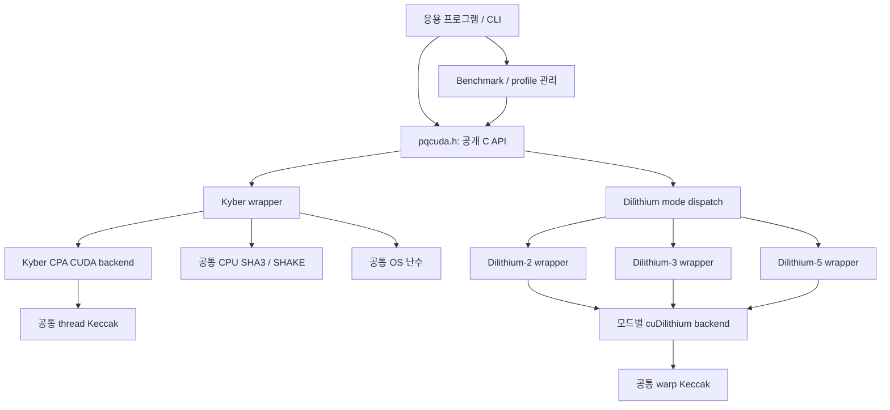
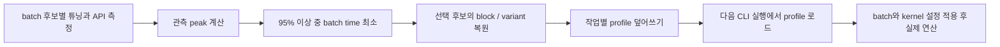

# PQCUDA 구현 논문 작성을 위한 기술 문서

> 작성 기준: 2026-09-10의 로컬 작업 트리. 이 문서는 **현재 구현에 대한 기술 분석과 논문 작성용 자료**이며, 표준 준수 인증이나 완성된 성능 평가 논문을 대신하지 않는다.
>
> 기준 Git HEAD: `860a3970a4a1ed3f477409a191daa92bf35d9e0b`. 현재 구현에는 이 커밋 이후의 미커밋 변경과 새 파일이 포함된다. 따라서 HEAD만 checkout해서는 본 문서의 구현을 재현할 수 없다.
>
> 프로젝트 원격 저장소: [kkookoo/PQCUDA](https://github.com/kkookoo/PQCUDA). 경로 링크는 이 Markdown 파일의 위치를 기준으로 한다.

## 문서 사용 방법

이 문서는 다음 세 가지 정보를 구분한다.

- **구현 확인**: 현재 소스 코드에서 직접 확인한 동작.
- **검증 기록**: 기존 실행 로그와 테스트에서 확인한 결과. 측정 당시 버전의 결과이다.
- **제안·미검증**: 논문 제출 전 추가로 수행할 실험, 구현 개선, 출처 확인 작업.

논문에서는 구현 확인 내용을 설계·구현 절에, 검증 기록을 조건이 명시된 예비 실험 절에 사용할 수 있다. 제안 항목을 이미 구현하거나 입증한 기여로 기술해서는 안 된다.

### 먼저 알아야 할 세 가지 제한

1. **현재 지원 명칭과 최종 표준 적합성은 다르다.** CLI의 `ML-KEM`·`ML-DSA` 표기는 Kyber1024·Dilithium-2/3/5 계열 구현을 가리킨다. 최종 FIPS 203/204와의 상호운용·공식 벡터 검증은 완료되지 않았다.
2. **Dilithium 키 생성에 테스트용 결정적 seed 생성이 남아 있다.** 공통 OS 난수 라이브러리를 만들었다고 모든 알고리즘의 키 생성 경로가 자동으로 안전한 난수를 사용하게 된 것은 아니다. 자세한 근거는 §7과 §15를 참조한다.
3. **Kyber wrapper의 공유 비밀 도출 경로에 참조 구현과의 차이가 있다.** 현재 정상 경로는 코드상 `SHAKE256(m || H(ciphertext), 32)`로 정리된다. Round-3 Kyber 참조 코드의 사전 키 사용과 다르며, 자체 encaps/decaps 왕복 성공만으로 이 차이가 검출되지는 않는다. §6.4와 §15에 구체적으로 설명한다.

## 목차

1. [프로젝트의 목적과 연구 범위](#scope)
2. [기존 구현의 출처와 재사용 범위](#provenance)
3. [전체 소프트웨어 아키텍처](#architecture)
4. [지원 파라미터와 공개 API](#api)
5. [공통 CPU·GPU 암호 라이브러리](#common)
6. [Kyber 통합 구조](#kyber)
7. [Dilithium 통합 구조](#dilithium)
8. [빌드·심볼·플랫폼 통합](#build)
9. [Benchmark와 자동 튜닝](#benchmark)
10. [최적 설정의 저장과 재사용](#profile)
11. [기존 구현 대비 변경 사항](#changes)
12. [확인된 테스트와 검증 범위](#validation)
13. [저장된 성능 결과의 해석](#results)
14. [논문용 실험 설계와 재현 절차](#experiments)
15. [현재 한계와 우선 개선 사항](#limitations)
16. [논문 구성 및 서술 예시](#writing)
17. [라이선스·인용·출처 추적](#references)
18. [소스 탐색 지도](#source-map)
19. [제출 전 점검 목록](#checklist)
20. [분석 기준 파일의 SHA-256](#snapshot)

<a id="scope"></a>
## 1. 프로젝트의 목적과 연구 범위

### 1.1 한 문장 설명

**PQCUDA는 기존 CUDA 기반 Kyber1024 및 cuDilithium 구현을 공통 C API, 공유·정적 라이브러리, 공통 해시 모듈, batch benchmark, 측정 기반 launch 설정 선택 및 재사용 기능으로 통합한 연구용 라이브러리이다.**

현재 빌드의 진입점은 [PQHybrid/CMakeLists.txt](../CMakeLists.txt)이고, 사용자용 인터페이스는 [pqcuda.h](../include/pqcuda.h)이다. `PQHybrid`라는 디렉터리명 자체가 고전 암호와 PQC를 결합한 hybrid 프로토콜을 구현한다는 의미는 아니다. 현재 공개 API는 Kyber 계열 KEM과 Dilithium 계열 서명 연산을 각각 제공하며, TLS·인증서·고전 KEM 결합 프로토콜은 구현 범위에 포함되지 않는다.

### 1.2 해결하려는 통합 문제

개별 GPU 구현을 응용 프로그램에서 사용하려면 알고리즘마다 다른 인터페이스, 파라미터 설정, 메모리 배치, 커널 실행 구성과 빌드 의존성을 다뤄야 한다. PQCUDA는 이러한 차이를 wrapper와 공통 빌드 계층에 모으고, 응용 프로그램이 host 버퍼와 C 함수 호출을 중심으로 사용할 수 있게 한다.

| 통합 문제 | 현재 대응 |
|---|---|
| 서로 다른 알고리즘별 호출 방식 | 단일 공개 C 헤더와 알고리즘별 wrapper |
| Dilithium 모드 간 동일 심볼 충돌 | 모드별 컴파일 및 내부 심볼 prefix |
| CPU 해시가 Dilithium 디렉터리에 종속 | `common/fips202_cpu`로 분리 |
| GPU 해시의 서로 다른 병렬화 방식 | thread 및 warp 구현을 별도 공통 타깃으로 유지 |
| GPU마다 적절한 workload가 다름 | 현재 CUDA device의 SM 수를 이용한 batch 후보 생성 |
| 하나의 block 설정을 모든 커널에 적용하기 어려움 | Kyber 커널별 block 및 Dilithium 단계별 variant 선택 |
| 처리량 극대화 시 batch 완료 시간이 길어짐 | peak throughput의 95% 이상에서 batch 완료 시간 최소화 |
| benchmark 결과를 실행에 재사용하기 어려움 | 작업별 profile 저장·복원 |
| Linux/Windows 패키징 차이 | CMake 공유·정적 타깃 및 설치 export |

### 1.3 논문에서 주장할 수 있는 기여의 범위

현재 코드로 뒷받침되는 기여는 **기존 GPU 암호 구현의 통합, 공통화, 측정·설정 관리 및 재사용 가능한 패키징**이다. 다음 항목은 독립적인 성능 또는 신규성 검증 전까지 주장하지 않는다.

- SHA3, SHAKE, NTT, Dilithium rejection scheduling을 새로 발명했다는 주장.
- 모든 GPU에서 최적의 occupancy 또는 최적 처리량을 보장한다는 주장.
- FIPS 203/204를 완전히 준수하는 production 암호 라이브러리라는 주장.
- 원 논문보다 빠르거나 CPU보다 몇 배 빠르다는 주장.
- 다중 GPU 또는 응용 수준 다중 stream 처리가 이미 자동화되어 있다는 주장.

<a id="provenance"></a>
## 2. 기존 구현의 출처와 재사용 범위

### 2.1 출처 확인 수준

| 구성요소 | 로컬 근거 | 확인된 내용 | 추가 확인이 필요한 내용 |
|---|---|---|---|
| Kyber GPU backend | [Kyber 디렉터리](../../ML-KEM/Kyber1024/Kyber_GPU_Batched), 파일의 Arpan Jati 저자 주석 | 2019년 8월 주석을 가진 CUDA 병렬 구현 계열, 기존 다항식·NTT·CPA 연산 재사용 | 가져온 원격 저장소 URL, 정확한 upstream commit 및 제출 버전 |
| cuDilithium | [로컬 README](../../ML-DSA/cuDilithium/README.md) | Shen 등 논문과 DOI, GPLv3 및 구성요소별 라이선스 설명 | 로컬 코드가 출발한 정확한 upstream commit |
| CPU FIPS202 | [공통 CPU 소스](../../common/fips202_cpu/fips202.c)의 출처 주석 | pq-crystals/Dilithium 경유 SHA3·SHAKE 일반 구현 | 최초 반입 버전의 해시 |
| Warp FIPS202 | [공통 warp 소스](../../common/fips202_cuda/warp/fips202.cu)의 저작권 주석 | Tatsuki Ono의 MIT 라이선스 구현을 수정한 계열 | 수정 이력과 최초 upstream revision |
| Thread FIPS202 | [공통 thread 소스](../../common/fips202_cuda/thread/fips202.cu)의 출처 주석 | Keccak 참조 코드 및 Arpan Jati의 CUDA 적응 구현 계열 | 정확한 원본 revision |
| PQM4 | [PQM4 프로젝트](https://github.com/mupq/pqm4) | 공통 기능과 시험·측정 체계를 분리하는 구조적 참고 대상 | PQM4 소스를 직접 사용했다는 근거는 없음 |

**원격 `main` 브랜치의 현재 코드와 유사하다는 사실은 특정 commit을 가져왔다는 증거가 아니다.** 논문 artifact에는 실제 사용한 upstream commit 또는 배포 archive의 digest를 기록하는 것이 필요하다.

### 2.2 cuDilithium에서 직접 활용한 기술

cuDilithium 원 연구는 GPU 연산·메모리 최적화, task batching, memory pool, 동적 task scheduling 및 여러 stream 활용을 설명한다. 이러한 기술은 기존 연구의 기여로 인용해야 한다. PQCUDA wrapper가 원 연구의 모든 실행 환경·stream 구성을 그대로 제공하는 것은 아니다. [Shen 등, 2024](https://eprint.iacr.org/2024/1365)

현재 소스에서 활용하는 것은 다음과 같다.

- `gpu_keypair`, `gpu_verify`와 서명 연산 커널.
- 행렬 확장, unpack/NTT 결합, `compute_y`, `compute_w`, `compute_cp`, rejection loop의 구현 변형.
- pitched memory pool 및 lookup table을 이용한 서명 재시도 처리.
- warp 기반 SHAKE/Keccak.

upstream의 [api.cu](https://raw.githubusercontent.com/encryptorion-lab/cuDilithium/main/src/api.cu)에도 `notmp_shake_new_kernel`, `polyvec_matrix_expand_opt_kernel`, `unpack_fuse_ntt_radix2_opt_kernel` 등의 호출이 존재한다. 따라서 이름에 `opt`가 붙은 커널을 PQCUDA가 새로 개발했다고 서술하면 안 된다. PQCUDA의 역할은 이 구현들을 통합하고, 여러 변형의 측정·선택·복원 경로를 제공하는 데 있다.

### 2.3 Kyber에서 직접 활용한 기술

로컬 Kyber backend의 다항식 표현, NTT, noise 생성, 행렬 생성, packing/unpacking, CPA keypair·enc·dec CUDA 경로를 재사용한다. 관련 파일에는 Arpan Jati와 기존 참조 구현을 바탕으로 CUDA 병렬화했다는 주석이 있다.

PQC GPU 가속에 관한 Gupta·Jati·Chauhan·Chattopadhyay의 연구는 관련 연구 후보이지만, **현재 폴더와 해당 논문의 공개 artifact가 동일 revision이라는 연결은 아직 확정하지 않았다.** 저자 주석만으로 논문의 모든 성능 수치나 최적화가 이 코드에 들어 있다고 단정하지 않는다.

### 2.4 로컬 개발 이력과 신규성의 구분

로컬 Git 이력에는 초기 통합, Kyber1024 전환, 대화형 파일 입출력, benchmark 작업 선택 및 batch-one 튜닝 등이 이미 존재한다. 현재 HEAD에도 Dilithium variant 선택·타이밍 코드의 일부가 들어 있다. 이후 작업 트리에는 batch 범위 확대, SM 기반 후보, 95% 선택 정책, profile, 공통 암호 모듈 및 추가 검증 등이 반영되어 있다.

따라서 이 문서의 “PQCUDA에서 추가한 기능”은 **프로젝트 차원의 통합 기능**을 뜻한다. 이를 특정 개발 일자 또는 특정 작성자의 독창적 발명으로 자동 귀속시키지 않는다.

<a id="architecture"></a>
## 3. 전체 소프트웨어 아키텍처

### 3.1 디렉터리 구조

```text
PQCUDA/
├── PQHybrid/
│   ├── CMakeLists.txt
│   ├── include/pqcuda.h
│   ├── src/
│   │   ├── main.c
│   │   ├── kyber_wrapper.cu
│   │   ├── dilithium_dispatch.cpp
│   │   ├── dilithium_wrapper.cu
│   │   ├── benchmark_gpu.cu
│   │   ├── benchmark_workloads.h
│   │   ├── benchmark_policy.h
│   │   ├── benchmark_profile.h
│   │   └── cli_platform.h
│   ├── tests/
│   ├── scripts/
│   ├── results/
│   └── docs/
├── common/
│   ├── CMakeLists.txt
│   ├── fips202_cpu/
│   ├── fips202_cuda/thread/
│   ├── fips202_cuda/warp/
│   └── randombytes/
├── ML-KEM/Kyber1024/Kyber_GPU_Batched/
└── ML-DSA/cuDilithium/
```

### 3.2 계층 간 관계



이 그림의 `DC`는 하나의 모드 미분화 바이너리를 뜻하지 않는다. 실제로는 모드별로 컴파일된 세 backend가 있고, 내부 CUDA 함수 이름을 구분한다.

### 3.3 공개 API와 CLI의 역할

- 공개 API: 연산 호출, 크기 조회, launch 튜닝, profile 값의 조회·적용.
- CLI: 메뉴, 메시지·hex 입력, batch 후보 순회, API 완료 시간 측정, 파일 profile 저장·로드.
- 공통 라이브러리: 알고리즘과 독립적인 CPU 및 GPU 해시 구현과 OS 난수 함수.
- 기존 backend: 알고리즘별 산술·인코딩·GPU 커널.

특히 **profile 파일을 자동으로 찾는 기능은 CLI 기능**이다. 외부 응용이 `pqcuda_kyber1024_keypair_batch()`만 호출한다고 파일이 자동 로드되지는 않는다. 외부 응용은 튜닝 API 또는 profile 적용 API를 명시적으로 호출해야 한다.

<a id="api"></a>
## 4. 지원 파라미터와 공개 API

### 4.1 현재 코드의 크기 상수

아래는 [pqcuda.h](../include/pqcuda.h)에 정의된 바이트 크기이다. 최종 NIST 표준 파라미터 표로 대체해서 읽으면 안 된다.

| 구현 이름 | 공개키 | 비밀키 | 암호문 | 공유 비밀 | 서명 |
|---|---:|---:|---:|---:|---:|
| Kyber1024 | 1568 | 3168 | 1568 | 32 | 해당 없음 |
| Dilithium-2 | 1312 | 2528 | 해당 없음 | 해당 없음 | 2420 |
| Dilithium-3 | 1952 | 4000 | 해당 없음 | 해당 없음 | 3293 |
| Dilithium-5 | 2592 | 4864 | 해당 없음 | 해당 없음 | 4595 |

Kyber는 `N=256`, `q=3329`, `K=4`, `ETA=2`를 사용한다. Dilithium은 `N=256`, `q=8380417`이며 `(K,L)`이 모드별로 `(4,4)`, `(6,5)`, `(8,7)`이다. 근거: [Kyber params.h](../../ML-KEM/Kyber1024/Kyber_GPU_Batched/params.h), [Dilithium params.h](../../ML-DSA/cuDilithium/include/params.h).

양쪽 API의 현재 최대 batch는 32768이다. 이는 API 및 저장 구조의 상한이며, 모든 GPU·메시지 크기에서 메모리가 충분함을 보장하는 값은 아니다.

### 4.2 API 그룹

| 그룹 | 주요 함수 |
|---|---|
| Kyber 연산 | `pqcuda_kyber1024_keypair[_batch]`, `encapsulate[_batch]`, `decapsulate[_batch]` |
| Kyber 튜닝 | `tune_launch_profile`, `tuned_kernel_count/name/threads`, `apply_launch_profile` |
| Kyber 관찰 | `print_tuned_kernel_details`, `export_tuning_csv` |
| Dilithium 연산 | `pqcuda_dilithium_keypair[_batch]`, `sign[_batch]`, `verify[_batch]` |
| Dilithium 모드 | `pqcuda_dilithium_mode`, 키·서명 크기 조회 함수 |
| Dilithium 튜닝 | `tune_sign_kernels`, `tuned_stage_count/name`, `tuned_variant_name`, `tuned_launch_config` |
| Dilithium profile | `get_launch_profile`, `apply_launch_profile` |

문서 작성 시 공개 헤더에 선언된 `pqcuda_*` 함수는 34개이다. 이는 공개 헤더의 함수 수이며 DLL의 실제 export 수를 새로 측정한 결과는 아니다.

### 4.3 Host 버퍼와 batch 배치

공개 연산 API는 host pointer를 받는다. 항목 `i`의 고정 길이 데이터는 `base + i * item_bytes`에 위치한다. batch 키 생성은 각 항목의 키쌍을 생성하는 방식이며 하나의 키를 모든 항목에 자동 공유하는 인터페이스가 아니다.

Dilithium 메시지도 항목별로 배치할 수 있지만 하나의 API 호출에서는 공통 `message_length`를 사용한다. 가변 길이 메시지 배열을 위한 offset/length 배열은 공개 API에 없다. CLI는 사용자가 입력한 하나의 메시지를 batch 전체에 반복한다.

크기 검증 방식도 완전히 동일하지 않다. Dilithium 공개 API는 버퍼 크기 인자를 받는 반면 Kyber는 크기 인자 없이 포인터와 batch를 받으므로 호출자가 충분한 버퍼를 확보해야 한다.

### 4.4 호출 완료와 동시성

wrapper 내부에서 CUDA 작업을 수행하고 동기화하므로 공개 연산 호출은 결과를 사용할 수 있는 상태로 돌아오는 동기 방식이다. CUDA stream을 받는 사용자용 비동기 API나 장기 재사용 context는 없다.

일부 launch 설정과 튜닝 결과가 전역·정적 상태에 저장된다. 서로 다른 host thread가 동시에 설정을 바꾸는 상황을 격리하는 context나 lock은 확인되지 않았다. 논문에서는 thread-safe tuning 또는 concurrent multi-client 서비스라고 표현하지 않는다.

<a id="common"></a>
## 5. 공통 CPU·GPU 암호 라이브러리

### 5.1 빌드 타깃

| 타깃 | 소스 위치 | 역할 |
|---|---|---|
| `pqcuda_fips202_cpu` | `common/fips202_cpu` | SHA3-256/512, SHAKE128/256, incremental 상태 API |
| `pqcuda_fips202_cuda_thread` | `common/fips202_cuda/thread` | 스레드 단위 Keccak, Kyber 해시 커널 |
| `pqcuda_fips202_cuda_warp` | `common/fips202_cuda/warp` | warp 단위 Keccak, Dilithium SHAKE 경로 |
| `pqcuda_random` | `common/randombytes` | Linux `getrandom`, Windows `BCryptGenRandom` 기반 함수 |

근거: [common/CMakeLists.txt](../../common/CMakeLists.txt).

### 5.2 공통화의 의미

공통화 이전에는 CPU FIPS202와 warp FIPS202가 cuDilithium 폴더에, thread FIPS202가 Kyber 폴더에 있었다. Kyber wrapper의 CPU 해시는 cuDilithium 쪽 CPU 구현에 링크하면서 함수 선언을 직접 반복했다.

현재는 실제 구현을 `common/`으로 옮겼고 wrapper가 공통 CPU 헤더를 직접 include한다. 기존 경로에는 공통 파일을 include하는 작은 호환 파일을 남겼다. 따라서 코드를 두 벌 유지하는 복사가 아니라 **공통 위치의 한 구현을 기존 경로에서도 참조하는 방식**이다.

cuDilithium의 `fips202` 타깃 이름은 호환용 INTERFACE 타깃으로 남아 CPU 및 warp 라이브러리를 연결한다. PQHybrid 빌드는 Kyber의 GPU 해시 소스를 `kyber_gpu` 안에서 중복 컴파일하지 않고 공통 thread 라이브러리에 연결한다.

### 5.3 왜 thread와 warp 구현을 하나의 커널로 합치지 않았는가

SHA3/SHAKE의 Keccak-f[1600] 상태는 25개의 64-bit lane으로 표현할 수 있다. 현재 thread 구현은 한 CUDA thread가 한 상태를 처리하고, warp 구현은 여러 lane이 상태 연산을 분담한다. 공통화는 알고리즘 선택과 GPU 병렬화 방식의 차이를 보존한다.

| 항목 | Thread 구현 | Warp 구현 |
|---|---|---|
| 주 사용자 | Kyber backend | Dilithium backend |
| 한 해시 상태의 담당 | 한 thread | 한 warp의 여러 lane |
| 상태 처리 | thread의 지역 상태·레지스터 연산 | lane별 상태와 shuffle 협력 |
| 실행 형태 | 많은 독립 입력을 thread 단위로 배치 | 한 입력 내부 계산을 warp 단위로 협력 |
| 통합 후 변화 | 위치·링크·충돌 상수 이름 정리 | 위치·알고리즘 전용 include 제거 |

공통화만으로 두 구현의 성능이 같아지거나 binary 크기가 일정 비율 감소한다고 주장할 수 없다. 서로 다른 상태 배치의 두 backend와 CPU backend는 여전히 필요하다. 코드 소유 위치와 의존성이 정리된 것이며, 성능·크기 변화는 별도 측정 대상이다.

공통 CPU 구현은 [FIPS 202](https://csrc.nist.gov/pubs/fips/202/final)의 SHA3·SHAKE 함수 계열을 제공한다. 함수 계열의 명칭과 테스트 통과는 암호 모듈 인증을 뜻하지 않는다.

### 5.4 공통화하지 않은 요소

- Kyber와 Dilithium의 NTT: modulus, 계수 표현 및 연산 경로가 다르다.
- sampling, packing, rejection: 알고리즘별 규칙과 데이터 구조를 유지한다.
- 두 알고리즘의 키 생성 난수 경로: OS RNG 모듈은 공통화했지만 모든 호출부를 동일 RNG로 바꾸지는 않았다.
- 최적화 함수 자체: 기존 thread·warp 코드의 수학적 동작을 통합 작업에서 재설계하지 않았다.

<a id="kyber"></a>
## 6. Kyber 통합 구조

### 6.1 CPU wrapper와 GPU CPA backend의 분담

[kyber_wrapper.cu](../src/kyber_wrapper.cu)는 공개 KEM API를 제공하면서 내부 CPA CUDA 연산을 호출한다.


`.cu` 파일에 들어 있다는 이유만으로 wrapper 전체가 GPU에서 실행되는 것은 아니다. 공개키 해시, 암호문 해시, 일부 KEM 도출·비교는 CPU 함수다. API benchmark에는 이러한 CPU 비용이 포함된다.

### 6.2 재사용한 커널과 데이터 배치

Kyber backend는 21개 튜닝 대상 kernel ID를 관리한다. SHA3, 행렬·noise 생성, NTT, pointwise accumulate, reduce/add/sub 및 packing 계열을 포함한다. 정확한 목록은 [indcpa.h](../../ML-KEM/Kyber1024/Kyber_GPU_Batched/indcpa.h)와 §18을 참조한다.

다항식은 개념적으로 `coeffs[coefficient].threads[item]`의 구조이다. batch의 여러 항목이 같은 계수 위치에 인접해 있으며, 일반적인 연산 경로에서는 thread 하나가 한 항목의 다항식 계수를 순회한다. Dilithium의 협력적 계수 분담과 구분해야 한다.

### 6.3 메모리 관리와 실제 비용

각 CPA 호출은 `KyberGpuContext`를 생성하고 stream 및 GPU 버퍼를 할당한 뒤 결과를 복사·동기화하고 해제한다. 이 context는 공개 API 호출 사이에 지속적으로 재사용되지 않는다.

특히 `poly` 타입의 내부 배열은 runtime batch가 아니라 compile-time `N_TESTS=32768`에 의존한다. 소스 타입 기준으로:

- `sizeof(poly) = 256 × 32768 × 2 = 16 MiB`.
- `sizeof(polyvec) = 4 × sizeof(poly) = 64 MiB`.
- context의 `4 × poly + 6 × polyvec + 4 × polyvec` 배열은 합계 약 **704 MiB**이다.

이 값은 주요 다항식 배열만의 **코드 기반 계산값**이며 측정된 peak VRAM이 아니다. seed, large buffer, 입출력 버퍼, CUDA 런타임과 allocator 오버헤드는 추가된다. 작은 batch에서도 큰 고정 배열을 할당하므로 batch-one 성능과 메모리 사용량을 논문에서 해석할 때 고려해야 한다.

### 6.4 현재 KEM wrapper의 정확한 동작과 참조 구현 차이

정상 encapsulation 경로의 코드 흐름을 요약하면 다음과 같다.

1. OS 난수 `r`을 생성하고 `m = SHA3-256(r)`를 계산한다.
2. `G = SHA3-512(m || SHA3-256(pk))`를 계산한다.
3. `G`의 뒤쪽 32바이트를 CPA encryption의 coins로 사용한다.
4. GPU CPA encryption으로 `c`를 생성한다.
5. 마지막 KDF 입력의 앞쪽 32바이트에 `m`을 복사하고 뒤쪽에는 `SHA3-256(c)`를 넣는다.
6. 최종 공유 비밀을 `SHAKE256(m || SHA3-256(c), 32)`로 생성한다.

Round-3 [Kyber 참조 kem.c](https://raw.githubusercontent.com/pq-crystals/kyber/round3/ref/kem.c)는 마지막 단계에서 `G`의 앞쪽 32바이트인 사전 키를 유지한다. 현재 wrapper는 그 부분을 `m`으로 재구성한다. 이 차이는 **단순히 CPU/GPU 구현 위치가 다른 문제와 별개**이다.

decapsulation도 복구한 메시지를 앞쪽에 넣어 같은 방식으로 도출하므로 자체 왕복은 성공할 수 있다. 암호문 재암호화 비교가 실패하면 앞쪽 값을 비밀키의 fallback `z`로 바꾼다. 따라서 “자체 왕복이 성공했다”와 “Kyber 참조 구현과 같은 shared secret을 낸다”는 별도 검증 항목이다.

이 문서에서는 이 경로를 관찰된 구현 사실로 기록한다. 논문에 표준 KEM 구현이라고 쓰기 전에 사용하려는 정확한 알고리즘 버전을 고정하고 KDF 경로와 공식·참조 벡터를 대조해야 한다.

<a id="dilithium"></a>
## 7. Dilithium 통합 구조

### 7.1 모드별 빌드와 dispatch

동일한 cuDilithium 소스는 `DILITHIUM_MODE=2,3,5`로 세 번 컴파일한다. `dilithium_dispatch.cpp`가 공개 enum을 해석하고 해당 모드 wrapper를 호출한다.

같은 이름의 CUDA 함수·전역 상수가 한 라이브러리 안에 충돌하지 않도록 CMake가 `crypto_sign_*`, `gpu_keypair`, `gpu_verify`, NTT 관련 심볼 등에 `dilithium2_`, `dilithium3_`, `dilithium5_` 등의 prefix를 적용한다. 공개 API는 공통 이름과 mode 인자를 유지한다.

### 7.2 메모리 배치와 완료 방식

- `cudaMallocPitch`를 이용해 항목별 메모리 row를 확보한다.
- byte 영역의 길이를 256-byte 단위로 맞추는 `ALIGN_TO_256_BYTES` 계산을 사용한다.
- 입력·출력은 `cudaMemcpy2DAsync` 경로로 이동한다.
- sign에는 batch 크기의 sign pool과 별도의 재시도용 temp pool이 있다.
- host lookup table 일부는 `cudaMallocHost`로 확보하고 대응하는 device table을 둔다.
- wrapper의 연산 완료에는 `cudaDeviceSynchronize`가 사용된다.

현재 wrapper는 원 연구의 응용 수준 다중 stream benchmark를 그대로 감싼 것이 아니다. backend가 stream 인자를 지원하더라도 공개 PQCUDA API는 이를 노출하지 않고, wrapper는 기본 stream 경로를 사용한다. OpenMP 링크 의존성이 있다고 자동으로 여러 host thread를 실행하는 것도 아니다.

### 7.3 서명 단계와 선택 가능한 실행 구조

| 단계 | 대표 구현 | block 구조 | grid의 항목 수 기준 |
|---|---|---|---|
| SHAKE | `notmp_shake_kernel`, `notmp_shake_new_kernel` | `(32,1)` / `(32,4)` | batch / `ceil(batch/4)` |
| 행렬 확장 | `polyvec_matrix_expand_kernel`, `..._opt_kernel` | `(32,1)` / `(32,4)` | batch / `ceil(batch/4)` |
| unpack + NTT | `unpack_fuse_ntt_kernel`, radix-2 및 opt 변형 | `(32,1)` / `(128,1)` | batch |
| y 생성 | `compute_y_kernel`, `compute_y_opt_kernel` | `(32,1)` / `(32,4)` | 내부 재시도 용량 |
| w 계산 | `compute_w_32t_kernel`, `compute_w_128t_kernel` | `(32,1)` / `(128,1)` | 내부 재시도 용량 |
| challenge 다항식 | `compute_cp_kernel`, `compute_cp_opt_kernel` | `(32,1)` / `(32,4)` | 내부 재시도 용량 |
| rejection loop | `rej_loop_32t_kernel`, `rej_loop_128t_kernel` | `(32,1)` / `(128,1)` | 내부 재시도 용량 |

단계별 variant 수는 `{2,2,3,2,2,2,2}`이다. 전체 조합은 192개이지만 현재 튜너는 이 192개 조합을 모두 end-to-end로 탐색하지 않는다. 각 단계를 순차적으로 측정해 선택한다.

`(32,4)`와 `(128,1)`은 모두 128 threads/block이지만 전자는 4개 항목을 warp 단위로, 후자는 한 항목을 더 많은 thread로 처리하는 경우가 있다. 단순히 block의 총 thread 수만 비교하면 데이터 처리 단위를 오해할 수 있다.

### 7.4 Rejection scheduling과 batch의 차이

현재 wrapper의 `EXEC_THRESHOLD`는 2048이다. 이것은 전체 batch 수가 아니라 한 번의 재시도 처리에 사용할 내부 실행 용량이다.

- 한 항목/block 변형의 재시도 grid: 2048.
- 네 항목/block 변형의 재시도 grid: 512.
- 전체 batch가 2048보다 크거나 작아도 이 실행 용량과 총 요청 수는 구분된다.
- lookup table은 미완료 서명과 nonce를 관리하며, 승인이 끝나지 않은 작업을 다시 배치한다.
- 최종 `sig_copy_kernel`은 runtime `copy_count`에 따른 grid와 96-thread block을 사용한다.

이 scheduling의 원형은 cuDilithium에서 재사용한 구조다. PQCUDA는 이를 새로 발명한 것으로 기술하지 않는다.

### 7.5 키 생성 난수의 현재 상태

[원본 계열 keypair.cu](../../ML-DSA/cuDilithium/src/keypair.cu)의 `gpu_keypair`는 다음 값을 seed 입력으로 사용한다.

```text
random_ctr = rand_index + 2 * blockIdx.x + 1
seed input = random_ctr의 8-byte 표현
seed = SHAKE 기반 확장 결과
```

[api.cuh](../../ML-DSA/cuDilithium/include/api.cuh)의 `rand_index` 기본값은 0이고, [현재 wrapper](../src/dilithium_wrapper.cu)의 키 생성 호출은 별도 값을 전달하지 않는다. 코드 분석상 같은 모드에서 호출을 반복하면 항목별 키가 반복될 수 있는 결정적 테스트 경로다. 원본 주석도 테스트 벡터용 우회 경로임을 명시한다.

이는 **서명의 deterministic signing 옵션과 다른 문제**이다. 서명 알고리즘이 결정적 nonce 도출을 지원하는 것과, 키 생성의 비밀 seed가 공개적으로 예측 가능한 것은 구분해야 한다. `common/randombytes`를 제공한다는 사실로 이 키 생성 문제가 해결되었다고 서술해서는 안 된다.

<a id="build"></a>
## 8. 빌드·심볼·플랫폼 통합

### 8.1 라이브러리 구성

| 구성 | 타깃 / 산출물 |
|---|---|
| 공개 공유 라이브러리 | `pqcuda` → Linux `libpqcuda.so`, Windows `pqcuda.dll` |
| 공개 정적 라이브러리 | `pqcuda_static` → Linux `libpqcuda.a`, Windows `pqcuda_static.lib` |
| Kyber 내부 backend | `kyber_gpu` |
| Dilithium 내부 backend | `cuDilithium2`, `cuDilithium3`, `cuDilithium5` |
| 공통 CPU 해시 | `pqcuda_fips202_cpu` |
| 공통 GPU 해시 | `pqcuda_fips202_cuda_thread`, `pqcuda_fips202_cuda_warp` |
| 공통 OS 난수 | `pqcuda_random` |
| 공유·정적 CLI | `pqcuda_test`, `pqcuda_test_static` |

공유 라이브러리에는 필요한 내부 정적 라이브러리를 링크한다. 정적 사용자에게는 CMake export 타깃이 내부 의존성 및 CUDA device link에 필요한 정보를 전달한다. 공통 GPU 해시 라이브러리를 생성하기만 하고 사용하지 않는 구조가 아니다.

### 8.2 공통 GPU 해시의 실제 사용 경로

| 알고리즘 경로 | 직접적인 호출·사용 예 | 공통 구현 | 빌드 연결 |
|---|---|---|---|
| Kyber CPA 키 생성 | `sha3_512_n` | thread SHA3-512 | `kyber_gpu` → `pqcuda_fips202_cuda_thread` |
| Kyber 행렬 생성 | `shake128_absorb`, `shake128_squeezeblocks` 및 symmetric adapter | thread SHAKE128 | 같은 thread 타깃 |
| Kyber noise/PRF | `shake256`을 사용하는 symmetric 경로 | thread SHAKE256 | 같은 thread 타깃 |
| Dilithium 키 생성 | warp SHAKE/Keccak를 이용한 seed 확장·sampling | warp FIPS202 | `cuDilithium{2,3,5}` → 호환 `fips202` → 공통 CPU·warp 타깃 |
| Dilithium 서명 | `notmp_shake_kernel`, `notmp_shake_new_kernel` 등 | warp SHAKE | 공통 warp 타깃 및 공통 헤더의 CUDA template |
| Dilithium 검증 | `gpu_verify` 내부의 SHAKE/Keccak | warp FIPS202 | 공통 warp 타깃 |
| Kyber wrapper의 KEM 후처리 | host `sha3_256`, `sha3_512`, `shake256` | **CPU** FIPS202 | `pqcuda` / `pqcuda_static` → `pqcuda_fips202_cpu` |

호출 근거: [indcpa.cu](../../ML-KEM/Kyber1024/Kyber_GPU_Batched/indcpa.cu), [symmetric-fips202.cu](../../ML-KEM/Kyber1024/Kyber_GPU_Batched/symmetric-fips202.cu), [Dilithium api.cu](../../ML-DSA/cuDilithium/src/api.cu), [keypair.cu](../../ML-DSA/cuDilithium/src/keypair.cu), [verify.cu](../../ML-DSA/cuDilithium/src/verify.cu).

일부 warp 함수는 `.cuh`의 CUDA template 형태이므로 호출하는 translation unit에도 코드가 생성될 수 있다. “공통 라이브러리에 분리했다”는 표현은 소스와 타깃의 공통 소유를 뜻하며, 모든 template 기계어가 최종 바이너리에서 정확히 한 벌만 존재한다는 의미가 아니다.

### 8.3 C ABI와 Windows export

공개 헤더는 `extern "C"`를 제공해 C++ name mangling을 피한다. Windows 공유 빌드는 `PQCUDA_BUILD_SHARED`와 `__declspec(dllexport)`를 사용하고, 소비자는 import 선언을 사용한다. 정적 링크 시에는 `PQCUDA_STATIC`을 정의한다.

Windows의 `pqcuda.lib`는 DLL용 import library이고 정적 라이브러리는 `pqcuda_static.lib`이다. 이 둘을 논문의 패키징 표에서 구분해야 한다.

### 8.4 설치와 외부 프로젝트

설치 대상에는 공개 라이브러리, 내부 정적 라이브러리, 공통 헤더, `pqcuda.h`, `PQCUDATargets.cmake`와 package config가 포함된다. 외부 CMake 프로젝트는 다음 형태로 연결한다.

```cmake
cmake_minimum_required(VERSION 3.20)
project(PQCUDAConsumer LANGUAGES C CXX CUDA)
find_package(PQCUDA CONFIG REQUIRED)
add_executable(app main.c)
target_link_libraries(app PRIVATE PQCUDA::pqcuda)
# 정적 링크: PQCUDA::pqcuda_static
set_target_properties(app PROPERTIES
    LINKER_LANGUAGE CXX
    CUDA_RESOLVE_DEVICE_SYMBOLS ON)
```

CPU 해시만 필요한 응용은 `PQCUDA::pqcuda_fips202_cpu`와 `<fips202_cpu/fips202.h>`를 사용할 수 있다. 공통 CPU 해시 사용 가능성과 전체 PQCUDA가 GPU 없이 동작하는 CPU fallback을 제공한다는 주장은 다르다. 전체 KEM/서명 연산의 CPU fallback은 현재 공개 API에 없다.

### 8.5 플랫폼 지원과 검증 수준

현재 CMake는 C11, C++17, CUDA17과 CUDA separable compilation을 설정한다. CUDA Toolkit과 OpenMP가 빌드 의존성이다. Linux와 Windows에 대한 조건부 코드 및 설치 구성을 제공한다.

이번 공통화 이후 실제로 확인한 것은 Linux 계열 환경의 공유·정적 빌드, 공통 라이브러리 설치, 외부 소비자 링크 및 cuDilithium-2 단독 테스트 실행 파일의 빌드다. 기존 README에는 Windows 빌드 검증 기록도 있으나, **공통화 이후 동일한 Windows 환경을 다시 검증한 기록은 이 문서에 없다.** 과거 README의 export 수 또는 툴체인 결과를 현재 버전의 새 검증으로 인용하지 않는다.

<a id="benchmark"></a>
## 9. Benchmark와 자동 튜닝

### 9.1 서로 다른 두 측정 단위

| 측정 | 목적 | 시간 범위 | 주의점 |
|---|---|---|---|
| GPU 커널 튜닝 | block·variant 선택 | CUDA event로 누적한 대상 kernel/stage 시간 | 전체 API 처리량과 다름 |
| 최종 API benchmark | batch 추천 | CPU의 단조 시계로 측정한 동기 API 호출 완료 시간 | 내부 할당·복사·CPU 작업·GPU 실행 포함 |

Kyber 커널 튜닝은 CPA keypair·encrypt·decrypt pipeline을 실행하며 대상 커널의 모든 호출 시간을 한 trial 안에서 합산한다. 같은 커널이 여러 번 호출되면 모두 포함한다. 따라서 `batch / kernel_total_time`은 pipeline 내 해당 커널의 누적 비용을 기준으로 한 batch 정규화 지표다. 한 번의 kernel invocation 처리량이나 전체 KEM 처리량이라고 표기해서는 안 된다.

### 9.2 측정 통계

현재 공통 정책은 [benchmark_policy.h](../src/benchmark_policy.h)에 있다.

- warmup: 3회.
- measured sample: 10회.
- 대표값: 정렬한 measured samples의 중앙값.
- near-peak 기준: 0.95.

batch 크기를 `B`, measured API 완료 시간을 `t(B,r)` ms로 정의하면:

\[
T(B)=\operatorname{median}_{r=1,\ldots,10} t(B,r)
\]

\[
L(B)=\frac{T(B)}{B}\quad[\mathrm{ms/op}],\qquad
Q(B)=\frac{1000B}{T(B)}\quad[\mathrm{ops/s}]
\]

CLI의 `Latency (ms/op)`는 `L(B)`이다. 이는 batch 전체 시간을 항목 수로 나눈 **평균화된 항목당 비용**이다. 요청 하나가 실제로 기다린 응답 시간, 큐 대기 시간, P99 latency 또는 kernel launch latency를 뜻하지 않는다. 한 batch가 완료되기까지의 시간은 `T(B)`이다.

### 9.3 95% 처리량 조건에서의 선택 기준

후보 집합을 `C`라 하면:

\[
Q_{\max}=\max_{B\in C}Q(B)
\]

\[
B^*=\underset{B\in C:\;Q(B)\ge 0.95Q_{\max}}{\operatorname{argmin}}\;T(B)
\]

즉, 최고 처리량을 엄밀히 선택하는 대신 **측정된 최고 처리량의 95%를 유지하는 범위에서 batch 완료 시간이 가장 짧은 후보**를 선택한다.

항목당 `L(B)`를 최소화하면 `Q(B)=1000/L(B)` 관계 때문에 최고 처리량 선택과 같은 방향이 된다. 현재 정책은 전체 `T(B)`를 최소화하므로 큰 batch를 불필요하게 선택하지 않으려는 절충이 가능하다.

95%는 통계적 신뢰수준이 아니다. 사용자가 선택한 처리량 보존 비율이다. `Q_max` 또한 이론상 최대 처리량이 아니라 **이번 탐색의 관측 최대값**이다.

### 9.4 현재 GPU의 SM 수를 이용한 batch 후보

현재 CUDA device를 `cudaGetDevice()`로 얻고 `cudaGetDeviceProperties()`의 `multiProcessorCount`를 조회한다. GPU 이름, SM 수, 최대 threads/block 및 계산된 batch 간격을 출력한다. 근거: [benchmark_gpu.cu](../src/benchmark_gpu.cu).

SM 수를 `S`, 기본 SM당 항목 수를 `g`라 하면 다음 절차를 사용한다.

```text
Kyber: g = 32
Dilithium: g = 4

while g > 1 and S * g > 2000:
    g = g / 2

u = S * g
k = max(1, round_half_up(1500 / u))
step = u * k

C = {작은 후보 1, 32, 128, 512 중 최대값 미만인 값}
    ∪ {step, 2*step, ... 중 최대값 미만인 값}
    ∪ {최대값}
```

구현은 부동소수점 rounding 대신 정수 나눗셈·나머지로 동일한 선택을 한다. 작은 후보와 마지막 최대값은 SM 정렬의 예외다. 일반적인 SM 수에서는 간격이 1000~2000이며, 극단적으로 `S > 2000`이면 SM 배수를 유지하기 위해 범위를 넘을 수 있다. 이는 고정폭 1000 간격을 다시 사용한 것이 아니라 SM 수에 따라 달라지는 간격이다.

| SM 수 | Kyber step | Dilithium step | 비고 |
|---:|---:|---:|---|
| 15 | 1440 | 1500 | 저장된 GTX 1070 로그의 SM 수 |
| 20 | 1280 | 1520 | 수식 예시, 별도 GPU 실측 아님 |
| 40 | 1280 | 1440 | 수식 예시 |
| 80 | 1280 | 1600 | Kyber의 기본 grouping 감소 |
| 132 | 1056 | 1584 | 수식 예시 |

SM 15개인 경우 Kyber 후보는 총 27개이며 `1,32,128,512,1440,2880,...,31680,32768`이다. Dilithium 후보는 총 26개이며 같은 작은 후보 뒤에 `1500,3000,...,31500,32768`이 이어진다.

### 9.5 SM 정렬과 occupancy를 구분해야 하는 이유

Kyber 커널의 grid는 일반적으로 다음과 같다.

\[
G(B,b)=\left\lceil\frac{B}{b}\right\rceil
\]

여기서 `b`는 threads/block이고 `B`는 독립 항목 수이다. batch가 `S × b`의 배수라면 해당 block 크기에서는 정수 개의 SM 단위 grid를 구성할 수 있다. 하지만 현재 batch 후보는 특정 기본 grouping을 이용하므로 모든 block 후보에 대해 동시에 이 관계를 보장하지 않는다.

또한 SM 수만으로 occupancy를 결정할 수 없다. registers/thread, shared memory/block, 활성 block 제한과 kernel 실행 특성이 영향을 준다. CUDA의 block scheduling 모델은 [NVIDIA CUDA 12.6 Programming Guide](https://docs.nvidia.com/cuda/archive/12.6.0/cuda-c-programming-guide/index.html)를 참조한다.

현재 탐색은 SM 수를 이용한 **후보 생성 휴리스틱**이다. occupancy API를 이용한 분석이나 Nsight 기반 occupancy 측정을 수행하는 기능은 아니다. 논문에서 “SM 수에 적응한다”는 표현은 가능하지만 “SM occupancy를 최적화함을 입증했다”는 표현은 추가 실험이 필요하다.

### 9.6 Kyber 커널별 block 탐색

후보 block은 `{16,32,64,128,192,256,512,1024}`이다. 현재 device의 최대 thread 수와 `cudaFuncGetAttributes`에서 얻는 해당 kernel의 지원 한도를 확인해 불가능한 후보를 제외한다.

각 batch와 block 후보에서 warmup 및 10회 측정을 수행하고, 커널별 중앙 누적 시간이 가장 작은 block을 고른다. 이렇게 얻은 서로 다른 kernel block들의 조합으로 선택한 API 작업을 다시 측정한다.

**95% 규칙은 최종 batch/API 후보 선택 규칙이다.** 커널 단계에서 고정된 batch에 대한 시간 최소화는 해당 커널의 처리량 최대화와 동치이다. `print_tuned_kernel_details`가 95% 범위의 행을 표시하는 것과 최종 API 후보를 고르는 것은 별도 동작이다.

모든 커널의 block 조합을 전수 탐색하지는 않는다. 커널별로 선택한 구성이 pipeline 상호작용까지 포함한 전역 최적이라고 보장하지 않는다.

### 9.7 Dilithium 단계별 variant 탐색

서명 작업은 각 batch에서 7개 단계의 variant를 순서대로 측정한다. 대상 단계의 CUDA event 누적 시간을 사용하고, 매 실행의 서명 검증을 수행한다. 각 단계의 중앙 시간이 가장 작은 variant를 선택한다.

keypair·verify는 고정된 `(32,1)` 구조를 사용하므로 sign variant 튜닝을 하지 않는다. 최종 API 비교는 해당 작업의 batch별 완료 시간을 사용한다.

### 9.8 측정에 포함·제외되는 항목

| 항목 | 최종 API 시간에 포함 여부 |
|---|---|
| API 내부 GPU 메모리·stream 생성과 해제 | 포함 |
| API 내부 CPU SHA3·SHAKE 및 난수 호출 | 해당 경로에 있으면 포함 |
| Host↔Device 전송 | 포함 |
| kernel 실행 및 wrapper 동기화 | 포함 |
| benchmark가 API 호출 전 만든 host 입력·출력 버퍼 | 제외 |
| 사전 kernel/variant 튜닝 | 제외 |
| encaps/decaps 입력을 준비하기 위한 별도 사전 연산 | 선택한 작업의 측정에서 제외 |
| CLI 메시지 입력·hex 파일 출력 | 제외 |
| 측정 구간 밖의 추가 correctness 검사 | 제외 |

따라서 측정값을 “kernel-only 시간” 또는 “네트워크 서비스 전체 latency”로 설명해서는 안 된다.

<a id="profile"></a>
## 10. 최적 설정의 저장과 재사용

### 10.1 저장 내용과 단위

CLI는 성공적으로 끝난 benchmark의 최적 batch와 launch 설정을 현재 디렉터리에 저장한다.

| 알고리즘 | 파일 이름 | values 내용 |
|---|---|---|
| Kyber1024 | `pqcuda_kyber_1024_opN.profile` | kernel ID 순서의 block size 21개 |
| Dilithium | `pqcuda_dilithium_MODE_opN.profile` | sign이면 단계별 variant 7개, keypair/verify이면 0개 |

`N=1,2,3`은 각 메뉴의 keypair·encap/sign·decap/verify 작업이다.

```text
PQCUDA_PROFILE_V1 <batch> <count>
<value 0>
<value 1>
...
```

profile에는 모든 grid 값을 별도로 넣지 않는다. Kyber grid는 저장된 batch와 block으로 계산하고, Dilithium은 variant와 batch 또는 내부 retry capacity에 따라 계산한다.

### 10.2 선택·복원 순서



마지막으로 측정한 큰 batch의 설정을 저장하는 것이 아니라, 선택된 후보의 snapshot을 복원해 저장한다. 매번 성공한 benchmark가 이전 파일을 덮어쓰며 별도 승인은 요구하지 않는다.

### 10.3 현재 검증과 한계

로드 시 version 문자열, batch 범위, 기대하는 entry 수와 형식을 확인한다. Kyber는 적용 시 block 지원 범위를, Dilithium은 variant 범위를 확인한다.

다만 profile에는 GPU UUID·device name·driver·CUDA 버전·소스 hash·측정 시각이 들어 있지 않다. 다른 GPU로 옮겼거나 코드를 변경하면 자동 무효화되지 않는다. 또한 `fopen(path,"w")` 방식이므로 저장 중 I/O 실패까지 포함한 원자적 교체를 보장하지 않는다. 이 두 항목은 논문 artifact를 장기간 재사용하려면 개선할 부분이다.

<a id="changes"></a>
## 11. 기존 구현 대비 변경 사항

| 구분 | 기존 코드 활용 | PQCUDA 통합에서 수행한 일 | 과장하면 안 되는 표현 |
|---|---|---|---|
| Kyber 산술 | NTT·다항식·packing·CPA kernel 재사용 | batch wrapper, CPU KEM 처리, launch 관찰·선택 연결 | 새로운 NTT 알고리즘 |
| Dilithium 서명 | 기존 협력형 커널과 retry scheduling 재사용 | 모드 dispatch, wrapper, variant 계측·선택·복원 | 새로운 rejection scheduler |
| 해시 | 기존 CPU·thread·warp FIPS202 재사용 | 공통 위치·타깃·헤더와 심볼 정리 | 새로운 SHA3 구현 또는 증명 |
| API | 기존 함수 위에 wrapper 구성 | C ABI, 크기·mode API, 공유·정적 패키징 | 모든 언어에서 바로 사용 가능한 검증 완료 SDK |
| 튜닝 | 원 커널의 가능한 실행 형태 활용 | 실측 block·variant 선택 및 SM 기반 workload | 전역 최적 launch 보장 |
| 정책 | 기존 throughput 및 시간 측정 활용 | 95% throughput 제약과 batch time 목적함수 | 통계적 95% 신뢰도 |
| 상태 관리 | 선택값을 메모리에 유지 | 최적 snapshot을 파일에 저장·다음 실행에 적용 | GPU 변경 자동 인식 profile |
| 검증 | 기존 알고리즘 실행 활용 | 공통 해시 벡터, 왕복·변조·profile·플랫폼 테스트 | 표준 인증 및 보안 증명 |

기존 GPU 코드의 최적화를 유지한 통합 논문이라면, 새 kernel 성능보다 **통합 비용, 사용자 인터페이스 일관성, 튜닝 정책의 실용적 효과, 재현성과 확장성**을 평가 중심으로 잡는 것이 현재 구현과 더 잘 맞는다.

<a id="validation"></a>
## 12. 확인된 테스트와 검증 범위

### 12.1 공통화 이후 실행한 CTest

2026-09-10 공통화 검증에서 GPU 접근이 가능한 환경으로 실행한 6개 테스트가 모두 통과했다.

| 테스트 | 확인하는 내용 |
|---|---|
| `common_crypto_roundtrip` | batch=3 Kyber keypair/encap/decap 일치, 암호문 변경 시 다른 secret, Dilithium 2/3/5 sign/verify 및 메시지 변경 거부 |
| `fips202_cpu` | SHA3-256/512·SHAKE128/256의 독립 벡터 및 incremental absorb/squeeze |
| `fips202_cuda` | thread SHA3/SHAKE, warp SHAKE, 부분 batch와 multi-block 출력 |
| `dilithium_launch` | 각 mode/variant의 launch geometry, snapshot, 범위 오류와 복원 |
| `benchmark_policy` | 95% 경계, SM 기반 후보, profile 저장·덮어쓰기·잘못된 형식 |
| `platform` | 긴 줄 입력, OS 난수 API, 단조 시계 |

근거 파일은 [tests 디렉터리](../tests)에 있다. `fips202_vectors.h`는 Python `hashlib`에서 생성한 기대값을 포함한다. 입력 길이는 `0,3,71,72,73,135,136,137,167,168,169,337`이며 SHAKE 출력은 337바이트를 포함해 rate 경계를 넘는다.

GPU 해시 테스트는 batch=5를 사용해 4개 항목을 묶는 block에서 마지막 일부 항목만 유효한 경우도 확인한다. CPU의 incremental SHAKE는 입력·출력을 나눠 호출했을 때 one-shot 결과와 일치하는지 비교한다.

### 12.2 이 테스트로 증명되지 않는 것

- FIPS 203/204 공식 KAT 통과 또는 타 표준 구현과의 상호운용.
- Dilithium 키 생성 seed의 예측 불가능성.
- 암호 알고리즘의 수학적 보안성 또는 전체 구현의 constant-time 성질.
- 모든 CUDA kernel variant 및 모든 가능한 길이의 완전한 기능 검증.
- 최대 batch·긴 메시지에서의 메모리 안전성과 성능.
- 장시간 실행, 동시 호출, 여러 GPU에서의 신뢰성.

특히 CUDA 해시 정답 테스트의 warp 경로는 `shake_kernel`을 직접 검사한다. `notmp_shake_new_kernel`을 비롯한 다른 최적화 경로는 알고리즘 왕복에서 일부 사용되지만 모든 입력 길이에 대한 별도 정답 검증이 완료된 것은 아니다.

### 12.3 CPU-only 테스트 성공과 GPU 검증 구분

GPU가 없거나 접근이 차단된 환경에서는 GPU 테스트가 종료 코드 77로 skipped된다. CTest의 최종 “실패 없음” 문구만 보면 GPU 검증 여부를 오해할 수 있으므로 논문 artifact에는 skipped 목록이 없는 GPU 실행 결과도 보관한다.

CLI의 `3. KAT test` 메뉴는 현재 준비 중 메시지를 출력한다. 메뉴가 존재한다는 이유로 KAT 기능이 완성됐다고 기술해서는 안 된다.

### 12.4 빌드·설치 확인

공통화 이후 다음 경로를 확인했다.

- PQHybrid 공유·정적 라이브러리와 두 CLI 빌드.
- cuDilithium 단독 프로젝트의 `cuDilithium2` 및 `test_cuDilithium2` 실행 파일 빌드.
- 임시 prefix에 라이브러리·공통 헤더·CMake export 설치.
- 별도 CMake 소비자의 공통 CPU 해시 링크·실행.
- 설치된 `PQCUDA::pqcuda_static`을 사용하는 소비자의 device link·실행.

단독 `test_cuDilithium2`는 이 검증에서 **빌드**한 것이다. 해당 프로젝트의 공식 test-vector 파일 digest 검사를 모두 실행했다고 서술하지 않는다.

<a id="results"></a>
## 13. 저장된 성능 결과의 해석

### 13.1 세 시점을 구분한다

| 데이터·코드 | 후보 방식 | 95% 기준 | 공통화 이후의 새 성능 측정인가 |
|---|---|---|---|
| `kyber_launch_throughput.csv` 및 기존 그래프 | 1 및 32부터 2배씩, 최대 32768 | 커널 원시 측정 자료 | 아니오 |
| `kyber_keypair_dense_benchmark.log` | 작은 후보 + 1000 간격, 총 37개 | 적용됨 | 아니오 |
| 현재 소스 | SM 기반 약 1000~2000 간격 | 적용됨 | 전체 성능 benchmark 재실행 기록 없음 |

**현재 SM 기반 탐색의 효과를 이전 1000 간격 로그로 입증해서는 안 된다.** 공통화로 성능이 유지되었다는 수치적 주장도 새 전후 측정이 필요하다.

### 13.2 기존 실측 환경

기존 로그·결과 설명에 기록된 환경:

- GPU: NVIDIA GeForce GTX 1070, 8 GiB.
- SM: 15.
- 최대 threads/block: 1024.
- CUDA Toolkit: 12.6, build architecture `sm_61`.
- 드라이버: 기존 결과 README에 560.94로 기록. 앞선 장치 조회에서는 Linux 측 560.35.02 표기도 함께 보였으므로 논문에는 원본 `nvidia-smi`를 보관해 host/guest 표기를 구분하는 것이 좋다.
- 기존 측정 당시 GPU는 화면 출력도 담당했다.

문서 작성 시 현재 OS는 Ubuntu 24.04.4 LTS, WSL2 kernel `6.18.33.2-microsoft-standard-WSL2`, CPU 노출 이름은 Intel Core i7-13700K이다. 이는 **작성 시점 환경 조회**이며 이전 benchmark 로그에 CPU/OS 전체 정보가 자동 기록된 것은 아니다.

### 13.3 Kyber keypair API의 예비 결과

출처: [kyber_keypair_dense_benchmark.log](../results/kyber_keypair_dense_benchmark.log).

| batch | 전체 중앙값 (ms) | 평균화된 latency (ms/op) | 처리량 (ops/s) |
|---:|---:|---:|---:|
| 1 | 30.455369 | 30.455369 | 32.835 |
| 8000 | 73.610796 | 0.009201 | 108679.711 |
| 16000 | 118.379414 | 0.007399 | 135158.635 |
| 19000 | 135.754796 | 0.007145 | 139958.223 |
| **20000** | **138.349740** | **0.006917** | **144561.168** |
| 27000 | 183.330862 | 0.006790 | 147274.713 |
| 30000 | 203.133573 | 0.006771 | 147686.075 |
| 32768 | 229.678133 | 0.007009 | 142669.220 |

관측 peak는 batch 30000의 147686.075 ops/s이다. 95% threshold는 약 140301.771 ops/s이고, batch 19000은 threshold 아래이다. 선택된 batch 20000은 peak의 약 97.88%를 달성하며 적격 후보 중 가장 짧은 batch 완료 시간을 가진다.

batch 30000 대비 batch 20000의 완료 시간은 약 31.89% 짧다. **이는 더 적은 작업 수를 가진 batch 간 완료 시간 비교이며 동일한 작업량의 31.89% 가속을 의미하지 않는다.** 정책 효과는 “처리량을 약 2.12% 낮추면서 더 작은 batch의 완료 시간을 선택했다”로 설명하는 것이 정확하다.

이 값은 keypair 결과이다. KEM 전체 교환, encaps, decaps 또는 Dilithium 처리량으로 일반화하지 않는다.

### 13.4 커널 그래프와 원시 자료

- [원시 CSV](../results/kyber_launch_throughput.csv): 21개 커널, 12개 batch, 총 1956개 행.
- [batch 32768의 전체 커널 그래프](../results/kyber_block_grid_32768.png).
- [grid 변화 그래프](../results/kyber_grid_sweep.png).
- [주요 커널 요약](../results/kyber_overview.png).
- [측정 설명](../results/README.md).

CSV의 batch 집합은 `1,32,64,128,256,512,1024,2048,4096,8192,16384,32768`이다. 지원되지 않는 block 크기는 빠져 있으므로 모든 커널에 8개 block 후보가 있는 것은 아니다.

논문용 그림 캡션에는 GPU, batch, 시간 단위, warmup/반복 수, kernel 누적 시간인지 API 시간인지, grid와 block의 관계를 반드시 넣는다. grid sweep에서는 같은 선을 따라 이동할 때 batch도 변한다. 이를 고정 batch에서 grid만 바꾼 실험처럼 설명하면 안 된다.

<a id="experiments"></a>
## 14. 논문용 실험 설계와 재현 절차

### 14.1 먼저 고정할 실험 대상

최종 표준 구현 논문을 목표로 한다면 §15의 알고리즘 적합성과 seed 경로를 먼저 정리하고, **그 수정 이후의 동일 revision**으로 성능 비교를 해야 한다. 연구용 통합 framework 논문이라면 기존 backend의 버전 및 제한을 명시하되 이를 production KEM·서명 성능처럼 제시하지 않는다.

### 14.2 권장 비교군

다음은 제안 실험이며 아직 실행된 결과가 아니다.

| 비교군 | 고정해야 할 조건 | 확인할 질문 |
|---|---|---|
| A. 원 backend | 정확한 upstream commit, 같은 파라미터·입출력·난수 경로 | wrapper 통합 비용은 얼마인가 |
| B. PQCUDA 기본 launch | 같은 코드, 튜닝 적용 전 | 자동 튜닝의 기준점 |
| C. 커널·variant 튜닝만 | batch 고정 | launch 선택의 기여 |
| D. 고정 간격 batch 탐색 | 비교 가능한 후보 개수·측정 예산 | SM 후보와 어떤 차이가 있는가 |
| E. SM 기반 탐색 | 현재 workload 정책 | GPU 변경 시 결과가 어떻게 달라지는가 |
| F. 100%/99%/95% 정책 | 같은 원시 측정값을 재사용 | 처리량과 batch 완료 시간의 trade-off |
| G. 공통화 전/후 | 수학적 구현과 GPU 코드 생성 옵션 동일 | 코드 관리 변화의 성능·binary 비용 |
| H. 선택 후 독립 재측정 | 선택에 쓰지 않은 새 반복 | 측정 잡음에 대한 과적합은 없는가 |

최적화 변형의 수와 전체 후보 개수가 다르면 튜닝에 쓴 비용도 함께 제시한다. 더 많은 후보를 측정한 정책이 더 좋은 결과를 냈다고 해서 후보 생성 방식 자체가 우수하다고 바로 결론 낼 수 없다.

### 14.3 측정 항목

필수 결과:

- 알고리즘·모드·작업별 API throughput.
- 전체 batch 완료 시간과 평균화된 `ms/op` 또는 `us/op`.
- 선택된 batch와 kernel block/variant.
- peak 대비 선택 throughput 비율.
- 튜닝 전체 소요 시간과 profile 재사용 시 startup 비용.
- peak VRAM 및 host pinned-memory 사용량.
- benchmark 전체를 독립적으로 여러 번 실행한 분산·신뢰구간.

추가 profiling:

- GPU kernel별 누적 시간 및 호출 횟수.
- host 해시·난수·할당·복사 비용의 분해.
- registers/thread, shared memory/block, achieved occupancy, memory throughput.
- 단일 호출과 지속적인 batch 처리에서의 차이.

현재 구현은 10개 sample의 median을 사용하지만 sample 전체를 최종 profile에 저장하지 않는다. 논문 수준의 분산·신뢰구간 분석을 하려면 raw sample export를 추가해야 한다. 95% throughput threshold를 신뢰구간으로 바꾸어 쓰면 안 된다.

### 14.4 공정한 baseline 비교

다음 조건을 맞추지 않으면 원 논문과의 speedup 비교가 왜곡될 수 있다.

1. 동일 알고리즘 버전과 parameter set.
2. 동일한 메시지 길이 및 입력 배치 구성.
3. 동일한 난수 생성 방식과 correctness 조건.
4. 동일한 시간 범위: kernel-only, transfer 포함, allocation 포함 여부.
5. 동일한 stream 수와 CPU thread 수.
6. 동일 GPU·clock·power 및 driver/Toolkit 설정.
7. 동일한 warmup·반복·대표값 계산법.
8. 동적 memory pool 재사용 여부.

원 논문의 고성능 server GPU 수치를 GTX 1070의 현재 API 수치와 직접 나누어 speedup으로 보고하지 않는다. 공통화 이전과 이후도 최적화 옵션이나 workload가 달라지면 공통화 효과만을 분리할 수 없다.

### 14.5 GPU 다양성 실험

현재 실제 기록은 GTX 1070 중심이다. 다른 GPU에 적응하는 정책을 논문 기여로 강조하려면 SM 수·아키텍처·메모리 특성이 다른 장치에서 측정한다. GPU명만 바뀐 것이 아니라 다음을 표로 남긴다.

| 항목 | 기록할 값 |
|---|---|
| 장치 | 모델, UUID 또는 연구용 식별자, SM 수, VRAM |
| 소프트웨어 | OS, driver, CUDA Toolkit, C/C++ compiler, CMake |
| 빌드 | commit, 미커밋 여부, source digest, `CMAKE_CUDA_ARCHITECTURES`, 최적화 flags |
| 실행 | 실제 device index, stream 수, CPU thread 수, display 사용 여부 |
| workload | batch 후보 목록, message length, block 후보, variant 후보 |
| 통계 | warmup, 반복 수, 독립 run 수, raw timings |

SM 수가 같은 서로 다른 GPU도 registers·cache·memory bandwidth 및 clock이 다를 수 있다. SM 기반 후보만으로 GPU 성능 차이를 모두 설명하지 않는다.

### 14.6 현재 코드의 재현 명령

아래는 저장소 루트에서 실행하는 예이다. `61`과 Toolkit 경로는 실제 GPU 및 설치 환경에 맞게 지정한다.

```bash
cmake -S PQHybrid -B PQHybrid/build-paper \
  -DCMAKE_CUDA_COMPILER=/usr/local/cuda-12.6/bin/nvcc \
  -DCMAKE_CUDA_ARCHITECTURES=61 \
  -DCMAKE_BUILD_TYPE=Release
cmake --build PQHybrid/build-paper --parallel 4
ctest --test-dir PQHybrid/build-paper --output-on-failure
cmake --install PQHybrid/build-paper --prefix PQHybrid/dist-paper
```

대화형 API benchmark:

```bash
./PQHybrid/build-paper/pqcuda_test
# 2. Benchmark
# 1. ML-KEM 또는 2. ML-DSA
# 해당 모드/작업 선택
```

Kyber keypair 자동 입력 예:

```bash
mkdir -p PQHybrid/results/paper-run
cd PQHybrid/results/paper-run
printf '2\n1\n1\n' | ../../build-paper/pqcuda_test > kyber-keypair.log 2>&1
```

현재 CLI는 한 번 실행한 후 종료한다. 같은 디렉터리에서 다시 실행하고 `Run algorithm`의 해당 작업에 들어가 저장된 최적 설정을 선택한다. profile은 실행 파일 옆이 아니라 **현재 working directory**를 기준으로 찾는다.

커널 그래프용 스크립트는 별도의 측정 경로이다.

```bash
# 현재 스크립트가 사용하는 고정 빌드 경로는 PQHybrid/build-cuda126이다.
python3 PQHybrid/scripts/measure_kyber.py
python3 PQHybrid/scripts/plot_kyber.py
```

`plot_kyber.py`는 matplotlib이 필요하고, 측정 스크립트는 CUDA device 접근이 필요하다. 현재 그래프 스크립트의 GPU 제목은 GTX 1070으로 고정되어 있으므로 다른 장치의 논문 그림을 생성할 때는 장치 metadata를 실제 측정에서 읽도록 수정해야 한다. 또한 고정 결과 파일명을 사용하므로 다른 실험의 결과를 덮어쓰지 않도록 run별 디렉터리·파일명을 관리해야 한다.

### 14.7 튜닝 비용의 상각

자동 튜닝은 무료가 아니다. 튜닝 시간 `T_tune`, 기본 설정의 batch당 시간 `T_default`, 선택 설정의 시간 `T_selected`를 같은 workload에 대해 측정하면, 양의 차이가 존재할 때 손익분기 반복 횟수를 다음처럼 평가할 수 있다.

\[
N_{break-even}=\left\lceil\frac{T_{tune}}{T_{default}-T_{selected}}\right\rceil
\]

이 식은 같은 batch와 같은 작업량을 비교할 때 의미가 있다. batch가 다른 정책끼리는 전체 처리 작업 수를 맞춘 서비스 모델로 상각을 계산해야 한다. profile을 저장해 다음 실행에서 재튜닝하지 않는 기능은 이 비용을 줄이기 위한 관리 기능으로 설명할 수 있다.

<a id="limitations"></a>
## 15. 현재 한계와 우선 개선 사항

### 15.1 표준 명칭과 구현 버전

NIST의 최종 ML-KEM과 ML-DSA는 각각 [FIPS 203](https://csrc.nist.gov/pubs/fips/203/final), [FIPS 204](https://csrc.nist.gov/pubs/fips/204/final)에 정의된다. 현재 코드의 이전 Kyber/Dilithium 계열 구조와 크기 상수를 최종 표준에 자동 대응시키지 않는다.

논문 초안에는 다음처럼 범위를 명시할 수 있다.

> 본 구현은 기존 Kyber1024 및 Dilithium-2/3/5 CUDA backend를 통합한 prototype을 대상으로 한다. 최종 ML-KEM/ML-DSA 표준과의 적합성 검증은 별도 과제로 구분한다.

최종 표준 구현을 논문 목표로 삼는다면 API 명칭뿐 아니라 seed 확장, hashing/domain separation, encoding, key validation, message context 및 공식 test vector 전반을 대상으로 차이를 점검해야 한다.

### 15.2 논문 결과 확정 전 우선 항목

| 우선순위 | 관찰·미검증 항목 | 필요한 조치 |
|---|---|---|
| 높음 | Dilithium keypair의 결정적 테스트 seed | OS CSPRNG 입력 경로를 실제 keypair에 연결하고 반복 키 검사 |
| 높음 | Kyber KDF의 사전 키 경로 차이 | 대상 Kyber/ML-KEM 버전 고정 후 참조 구현과 differential test |
| 높음 | 자체 왕복과 표준 적합성의 혼동 | 공식·참조 벡터 및 교차 구현 검증 |
| 높음 | 기존 그래프·수치와 현재 SM 정책의 버전 차이 | 현재 확정 revision에서 benchmark 재실행 |
| 중간 | profile에 GPU·소스 정보가 없음 | provenance metadata 및 mismatch 처리 |
| 중간 | 큰 고정 Kyber 버퍼 | 실제 메모리 계측 후 동적 batch 크기의 배치 또는 context 재사용 검토 |
| 중간 | 전역 launch/tuning 상태 | 멀티클라이언트 context 또는 동시성 제한 문서화 |
| 중간 | allocation 실패 경로 및 일부 CUDA 반환값 처리 | fault injection·sanitizer·오류 경로 검토 |
| 중간 | variant별·길이별 테스트가 제한적 | 모든 지원 variant의 벡터 테스트 확대 |
| 낮음 | CLI KAT 메뉴 미구현 | CTest 검증과 연결하거나 구현 범위를 명확히 표시 |

### 15.3 보안성 관련 서술의 경계

코드에는 암호문 비교 결과를 축약하고 조건부 바이트 이동을 하는 경로가 있다. 그러나 이러한 코드 패턴이 있다는 사실만으로 전체 CPU/GPU 구현의 constant-time 성질을 증명할 수 없다. compiler 출력, secret-dependent memory access, retry 동작 및 시스템 수준 측정은 별도 검토 대상이다.

OS RNG 호출이 성공했다는 테스트 역시 전체 키 생성·서명 경로의 entropy 사용을 검증하는 것은 아니다. 현재 Dilithium keypair 문제는 이 차이를 보여 주는 구체적인 사례다.

현재 CLI는 키와 공유 비밀을 평문 hex 파일로 저장한다. 이는 실험·연동용 도구의 동작이며, 안전한 키 저장 시스템을 제공한다는 의미는 아니다.

### 15.4 성능 해석의 경계

- batch 증가가 항상 처리량 증가를 뜻하지 않는다. 기존 30000과 32768 결과에서도 감소가 관측된다.
- 현재 API에는 persistent memory context가 없으므로 할당·초기화 비용이 크게 포함될 수 있다.
- GPU event instrumentation은 kernel 간 동기화와 scheduling에 영향을 줄 수 있다.
- 원 backend의 multi-stream 성능 결과를 현재 wrapper의 성능으로 인용할 수 없다.
- 현재 실험만으로 안정적인 tail latency, 에너지 효율, 장기간 처리량을 주장할 수 없다.
- 서로 다른 batch의 완료 시간 감소를 동일 작업량에 대한 speedup으로 표현하면 안 된다.

<a id="writing"></a>
## 16. 논문 구성 및 서술 예시

### 16.1 제목 후보

- **PQCUDA: 기존 CUDA 기반 격자 암호 구현의 통합과 측정 기반 실행 설정 관리**
- **PQCUDA: A Unified CUDA Library for Kyber- and Dilithium-Family Implementations**
- **기존 GPU 격자 암호 구현을 위한 공통 라이브러리 및 처리량 제약 기반 Batch 선택**

최종 표준 적합성을 검증하기 전에는 제목에 “FIPS-compliant ML-KEM/ML-DSA implementation”을 넣지 않는다.

### 16.2 논문 절 구성

| 논문 절 | 포함할 내용 | 필요한 증거 |
|---|---|---|
| Introduction | 독립 GPU 구현을 재사용할 때의 통합·설정 문제 | 기존 프로젝트의 API·빌드 차이 |
| Background / Related Work | Kyber·Dilithium, GPU mapping, PQM4, cuDilithium | 원 논문과 표준 문서 |
| Design Goals | C ABI, backend 보존, 관찰 가능한 튜닝, 재현성 | 설계 범위와 비목표 |
| Architecture | wrapper, mode dispatch, common primitives, CMake | 계층도·소스·API 표 |
| Implementation | 메모리 배치, CPU/GPU 경계, 심볼 분리 | 코드 위치와 실행 경로 |
| Configuration Selection | SM 후보, block/variant 탐색, 95% 정책 | 수식·의사코드·raw measurements |
| Evaluation | baseline, ablation, correctness, memory, 튜닝 비용 | 확정 revision의 새 실험 |
| Limitations | 표준·seed·concurrency·profile 등 | 구현 관찰과 미검증 목록 |
| Conclusion | 검증한 통합·관리 결과만 요약 | 앞 절에서 제시한 결과 |

### 16.3 기여 서술 예시

> 본 연구는 기존 CUDA 기반 Kyber 및 Dilithium 구현을 공통 C 인터페이스와 공유·정적 라이브러리로 통합하는 PQCUDA를 제시한다. 알고리즘별 GPU 연산 구조를 유지하면서 CPU 및 GPU SHA3/SHAKE 구현을 공통 모듈로 분리하고, 파라미터별 심볼 충돌과 메모리 관리 차이를 wrapper 계층에서 처리한다. 또한 GPU의 SM 수에 연관된 batch 후보와 기존 kernel 실행 변형을 측정하여, 관측 최대 처리량의 95% 이상을 유지하는 후보 중 batch 완료 시간이 가장 짧은 설정을 선택하고 재사용한다.

이 문단은 구현 기능을 서술한다. “성능이 향상되었다”는 문장은 별도 비교 실험의 수치와 조건을 붙여야 한다.

### 16.4 기존 코드 활용 서술 예시

> PQCUDA의 다항식 산술과 주요 GPU kernel은 기존 구현을 기반으로 한다. Kyber backend는 기존 CUDA CPA 연산 및 계수별 batch 메모리 표현을 재사용하고, Dilithium backend는 cuDilithium의 협력적 kernel과 서명 재시도 scheduling을 활용한다. 본 연구의 구현 기여는 이들 backend를 단일 라이브러리 구조로 연결하고, 공통 암호 primitive·API·실행 설정 측정 및 지속 저장을 제공하는 데 있다.

### 16.5 예비 결과 서술 예시

> 공통화 이전의 1000 간격 batch 탐색 기록에서 GTX 1070의 Kyber 계열 keypair API는 batch 30000에서 약 147.7 kops/s의 관측 최대 처리량을 보였다. 95% 조건을 적용하면 batch 20000이 선택되었으며, 약 144.6 kops/s와 138.35 ms의 batch 완료 시간을 기록했다. 이 결과는 서로 다른 batch 크기 사이의 처리량·완료 시간 절충을 보여 주는 예비 자료이며, 현재 SM 기반 탐색 정책의 성능 효과를 검증하는 결과로 사용하지 않는다.

### 16.6 논문용 그림·표 제안

1. 계층별 dependency 및 CPU/GPU 경계 그림.
2. Kyber의 thread-per-item과 Dilithium의 warp-per-item 메모리 대응 그림.
3. 공통화 전후 source ownership과 build target 표.
4. batch에 따른 throughput·batch time 곡선과 95% 기준선.
5. 같은 raw data에서 100%/99%/95% 정책의 선택점 비교.
6. 커널별 block/variant와 누적 시간 표.
7. GPU별 SM 수·step·선택 batch·VRAM·튜닝 시간 표.
8. 원 backend 대비 wrapper 및 host 처리 비용 분해.

<a id="references"></a>
## 17. 라이선스·인용·출처 추적

### 17.1 로컬 라이선스 inventory

아래는 로컬 소스·README가 제공하는 표시를 정리한 것이다. 저장소 전체에 새 단일 라이선스를 부여한 것은 아니다.

| 구성 | 확인한 표시 | 로컬 근거 |
|---|---|---|
| cuDilithium 본체 | GPLv3 | [COPYING](../../ML-DSA/cuDilithium/COPYING), [README](../../ML-DSA/cuDilithium/README.md) |
| 일부 Dilithium 참조 헤더 | Apache 2.0 | [APACHE_LICENSE](../../ML-DSA/cuDilithium/include/APACHE_LICENSE) |
| cuDilithium 계열 CUDA FIPS202 | MIT, Tatsuki Ono 저작권 주석 | [MIT_LICENSE](../../ML-DSA/cuDilithium/src/fips202/MIT_LICENSE), 공통 warp 소스 주석 |
| CPU FIPS202 참조 구현 | README에 CC0로 설명, 파일에 참조 출처 주석 | [CC0_LICENSE](../../ML-DSA/cuDilithium/src/fips202/CC0_LICENSE) |
| Kyber 코드 디렉터리 | 상위 디렉터리에 GPLv3 LICENSE, 파일별 출처 주석 | [Kyber LICENSE](../../ML-KEM/Kyber1024/LICENSE) |
| PQCUDA 자체 통합 코드 전체 | 별도의 최상위 통합 라이선스는 이번 분석에서 확정하지 않음 | 배포 전 관리 항목 |

공통 위치로 이동한 소스의 저작권·출처 주석은 유지되어 있다. 다만 license 전문 일부는 기존 알고리즘 폴더에 남아 있으므로 논문 artifact나 독립 common 배포본을 만들 때도 관련 provenance와 license 파일을 함께 관리해야 한다.

### 17.2 확인된 일차 자료

- **[R1] cuDilithium 연구** — Shiyu Shen, Hao Yang, Wangchen Dai, Hong Zhang, Zhe Liu, Yunlei Zhao. *High-Throughput GPU Implementation of Dilithium Post-Quantum Digital Signature*. [ePrint 2024/1365](https://eprint.iacr.org/2024/1365). 로컬 README의 DOI: [10.1109/TPDS.2024.3453289](https://doi.org/10.1109/TPDS.2024.3453289). 원 논문의 최적화·scheduling 재사용 설명에 사용한다.
- **[R2] cuDilithium 공개 저장소** — [encryptorion-lab/cuDilithium](https://github.com/encryptorion-lab/cuDilithium). [현재 upstream api.cu](https://raw.githubusercontent.com/encryptorion-lab/cuDilithium/main/src/api.cu). 정확한 반입 commit은 별도 기록해야 한다.
- **[R3] PQM4 연구** — Matthias J. Kannwischer, Joost Rijneveld, Peter Schwabe, Ko Stoffelen. *pqm4: Testing and Benchmarking NIST PQC on ARM Cortex-M4*. [ePrint 2019/844](https://eprint.iacr.org/2019/844). 공통 측정 framework 관련 연구로 인용한다.
- **[R4] PQM4 공개 저장소** — [mupq/pqm4](https://github.com/mupq/pqm4). 공통 코드 및 테스트·benchmark 구조의 참고 대상이며, PQCUDA가 이 저장소를 직접 fork했다는 뜻은 아니다.
- **[R5] NIST FIPS 202** — [SHA-3 Standard: Permutation-Based Hash and Extendable-Output Functions](https://csrc.nist.gov/pubs/fips/202/final). SHA3·SHAKE의 기준 문서.
- **[R6] NIST FIPS 203** — [Module-Lattice-Based Key-Encapsulation Mechanism Standard](https://csrc.nist.gov/pubs/fips/203/final). 최종 ML-KEM의 기준 문서.
- **[R7] NIST FIPS 204** — [Module-Lattice-Based Digital Signature Standard](https://csrc.nist.gov/pubs/fips/204/final). 최종 ML-DSA의 기준 문서.
- **[R8] CUDA 12.6 Programming Guide** — [NVIDIA 공식 문서](https://docs.nvidia.com/cuda/archive/12.6.0/cuda-c-programming-guide/index.html). thread/block/SM, 동기화 및 메모리 모델의 배경.
- **[R9] Kyber Round-3 참조 KEM 코드** — [pq-crystals/kyber, round3/ref/kem.c](https://raw.githubusercontent.com/pq-crystals/kyber/round3/ref/kem.c). 현재 wrapper의 KDF 경로 대조에 사용했다. 최종 FIPS 203 코드와 동일하다고 가정하지 않는다.

### 17.3 Kyber 원 artifact의 출처 보완

관련 연구 후보는 *PQC Acceleration Using GPUs: FrodoKEM, NewHope, and Kyber*이다. [연구자 페이지](https://sites.google.com/view/amitchauhan/home)에서 이 연구 제목을 확인할 수 있으나, 현재 로컬 `Kyber_GPU_Batched`의 정확한 공개 저장소·commit과 연결되는 artifact는 아직 확정하지 않았다.

논문 제출 전 다음을 작성자가 보완해야 한다.

- 처음 다운로드한 repository/archive URL.
- commit ID 또는 archive SHA-256.
- 사용한 알고리즘 제출 버전.
- 원 논문의 최종 bibliographic metadata.
- 로컬 수정과 원본 간 diff.

연결이 확인되기 전에는 해당 논문의 모든 구현 또는 속도 수치를 PQCUDA의 직접 기반으로 단정하지 않는다.

### 17.4 BibTeX 시작점

다음 두 항목은 확인한 ePrint 정보를 바탕으로 한 시작점이다. 저널 양식에 따라 최종 출판 버전으로 교체할 수 있다.

```bibtex
@misc{shen2024cudilithium,
  author = {Shiyu Shen and Hao Yang and Wangchen Dai and Hong Zhang
            and Zhe Liu and Yunlei Zhao},
  title = {High-Throughput {GPU} Implementation of Dilithium
           Post-Quantum Digital Signature},
  howpublished = {Cryptology ePrint Archive, Paper 2024/1365},
  year = {2024},
  url = {https://eprint.iacr.org/2024/1365}
}

@misc{kannwischer2019pqm4,
  author = {Matthias J. Kannwischer and Joost Rijneveld
            and Peter Schwabe and Ko Stoffelen},
  title = {pqm4: Testing and Benchmarking {NIST} {PQC} on {ARM} Cortex-M4},
  howpublished = {Cryptology ePrint Archive, Paper 2019/844},
  year = {2019},
  url = {https://eprint.iacr.org/2019/844}
}
```

<a id="source-map"></a>
## 18. 소스 탐색 지도

| 설명하려는 내용 | 주요 파일·함수 |
|---|---|
| 공개 ABI·크기·mode | [include/pqcuda.h](../include/pqcuda.h) |
| 공유·정적 타깃·mode prefix·설치 | [CMakeLists.txt](../CMakeLists.txt) |
| 공통 암호 타깃 | [common/CMakeLists.txt](../../common/CMakeLists.txt) |
| Kyber CPU/GPU 경계 | [kyber_wrapper.cu](../src/kyber_wrapper.cu): `cpa_*_batch`, 공개 KEM 함수 |
| Kyber kernel 계측 | [indcpa.cu](../../ML-KEM/Kyber1024/Kyber_GPU_Batched/indcpa.cu): `tuning_start/stop`, `selected_block_size` |
| Kyber kernel ID 순서 | [indcpa.h](../../ML-KEM/Kyber1024/Kyber_GPU_Batched/indcpa.h) |
| Kyber 계수별 batch 표현 | [poly.h](../../ML-KEM/Kyber1024/Kyber_GPU_Batched/poly.h), [polyvec.h](../../ML-KEM/Kyber1024/Kyber_GPU_Batched/polyvec.h) |
| Dilithium mode dispatch | [dilithium_dispatch.cpp](../src/dilithium_dispatch.cpp) |
| Dilithium 메모리·튜닝·profile | [dilithium_wrapper.cu](../src/dilithium_wrapper.cu) |
| Dilithium scheduling·계측 | [api.cu](../../ML-DSA/cuDilithium/src/api.cu) |
| Dilithium 연산 커널 | [sign.cu](../../ML-DSA/cuDilithium/src/sign.cu), [keypair.cu](../../ML-DSA/cuDilithium/src/keypair.cu), [verify.cu](../../ML-DSA/cuDilithium/src/verify.cu) |
| CPU SHA3/SHAKE | [공통 fips202.c](../../common/fips202_cpu/fips202.c) |
| Thread Keccak | [공통 thread fips202.cu](../../common/fips202_cuda/thread/fips202.cu) |
| Warp Keccak | [공통 warp fips202.cu](../../common/fips202_cuda/warp/fips202.cu), [fips202.cuh](../../common/fips202_cuda/warp/fips202.cuh) |
| OS RNG | [randombytes.c](../../common/randombytes/randombytes.c) |
| SM 후보 계산 | [benchmark_workloads.h](../src/benchmark_workloads.h), [benchmark_gpu.cu](../src/benchmark_gpu.cu) |
| 95% 선택 조건 | [benchmark_policy.h](../src/benchmark_policy.h) |
| API 시간 측정·CLI | [main.c](../src/main.c), [cli_platform.h](../src/cli_platform.h) |
| profile 직렬화 | [benchmark_profile.h](../src/benchmark_profile.h) |
| 커널 CSV 측정·그림 | [measure_kyber.py](../scripts/measure_kyber.py), [plot_kyber.py](../scripts/plot_kyber.py) |
| 기능·해시·정책 검증 | [tests/](../tests) |

### 18.1 Kyber 튜닝 대상 21개

```text
sha3_512_n
 gen_matrix_n
 poly_getnoise
 polyvec_ntt_n
 polyvec_pointwise_acc_n
 poly_frommont_n
 polyvec_add_n
 polyvec_reduce_n
 pack_sk_n
 pack_pk_n
 unpack_pk_n
 poly_frommsg_n
 polyvec_invntt_n
 poly_invntt_n
 poly_add_n
 poly_reduce_n
 pack_ciphertext_n
 unpack_ciphertext_n
 unpack_sk_n
 poly_sub_n
 poly_tomsg_n
```

위 목록은 CPA pipeline 전체 대상이다. 개별 keypair·encap·decap은 필요한 부분만 호출하므로 API별로 21개 모두가 한 번씩 실행되는 것으로 세면 안 된다.

<a id="checklist"></a>
## 19. 제출 전 점검 목록

### 알고리즘·출처

- [ ] 사용한 Kyber/Dilithium 버전과 최종 표준과의 관계를 확정한다.
- [ ] Kyber KDF와 Dilithium seed 경로의 문제를 해결하거나 연구 범위에 명시한다.
- [ ] 원 backend의 정확한 repository·commit·license를 기록한다.
- [ ] 기존 kernel과 PQCUDA 통합 기여를 구분한다.
- [ ] 공식·참조 벡터 및 교차 구현 검증 결과를 확보한다.

### 성능·재현성

- [ ] 확정 commit으로 모든 baseline과 제안 설정을 다시 빌드한다.
- [ ] current SM 기반 후보의 새 benchmark를 실행한다.
- [ ] raw sample과 GPU·CPU·OS·compiler·driver metadata를 저장한다.
- [ ] batch time과 amortized latency, kernel time과 API time을 구분한다.
- [ ] tuning budget과 독립 재측정 결과를 포함한다.
- [ ] 다른 GPU 결과 없이 다중 GPU 환경에서의 성능 개선을 주장하지 않는다.
- [ ] 공통화 전후 성능·메모리·binary 크기를 같은 조건에서 비교한다.

### artifact·문서

- [ ] profile에 장치와 source revision 식별자를 추가하거나 사용 제한을 명시한다.
- [ ] 그래프 제목의 GPU명과 측정 metadata가 일치하는지 확인한다.
- [ ] Windows의 현재 revision 검증과 과거 검증 기록을 구분한다.
- [ ] KAT 메뉴, 테스트 skip, 미구현 기능을 명확히 표시한다.
- [ ] 배포 archive에 공통 라이브러리 의존성과 license·출처 정보를 포함한다.
- [ ] HEAD뿐 아니라 미커밋 변경까지 포함하는 최종 revision을 확정한다.

<a id="snapshot"></a>
## 20. 분석 기준 파일의 SHA-256

아래 digest는 문서 작성 시 읽은 주요 코드 및 결과 파일을 식별한다. 저장소 전체의 완전한 manifest는 아니며, 향후 수정 시 갱신해야 한다. 동일한 Git HEAD라도 미커밋 파일이 다르면 구현이 달라질 수 있으므로 주요 근거를 별도로 남긴다.

```text
6013305b6d465d7bb438e626955ff10b6e4778228fea66e3dbaf8878cef32a79  PQHybrid/include/pqcuda.h
88ba908f2413a4a5c3cc231f2af04f23d98b70b0c94d6e0ecb1c15582dd1feee  PQHybrid/CMakeLists.txt
b861b8a446c1d47c26c5cb8f1b235533257482c2fb7983d1b0bb82e2000db554  PQHybrid/src/kyber_wrapper.cu
6c38a1c02e5c2c4d8a36111642ca632950e1c5f7b49723c9a48ffeeaae443637  PQHybrid/src/dilithium_dispatch.cpp
35d71a47fc961ce5fba9a036e7df3443d8bdc24a1ff302e67b33dae2dcd0fad5  PQHybrid/src/dilithium_wrapper.cu
4f29d623e83e0b78a547c73a748eacf42fd30c86f9e9e322dc8309a14bf20f6e  PQHybrid/src/main.c
e0d28c7f659b34ab50696dff96b17acb672668be1e7853ee38b4123654d78086  PQHybrid/src/benchmark_workloads.h
61a1ec9a0646f9bc70fc2c34fcae7bff7bcfd946505b9179849519dfdd3ff2a5  PQHybrid/src/benchmark_policy.h
5819f468bc36cba3c0c28f59fbd996f95891a2e511ae85d2e89545733c862d91  PQHybrid/src/benchmark_profile.h
172d7aeee53e911f073adc05f14a58eee47e164a5394b84fdaec82a524eeee58  common/CMakeLists.txt
bad9f036f113d2e7654ad1c613d0ebfbc7f9fde39fc7579ade8ccf594c895747  common/fips202_cpu/fips202.c
07ee40c0097dcd291cd2423c2c8108637ab6a0923f2f6acae71feace1ca24a20  common/fips202_cuda/thread/fips202.cu
d2741e5e23747211962b924c3ab46a3f49186b1ae9bfac46dd8a56ef33254e4e  common/fips202_cuda/warp/fips202.cu
c858dc496d38fe0235e1e260e472b808a385299210dedcf6ac3280339a4eefc1  common/fips202_cuda/warp/fips202.cuh
aaf1eabf763e9ec74322268ad43526b6d56fe70db900de8e95724f475bd73354  common/randombytes/randombytes.c
e10d7584b4c87d78de008186be1422938727f57eb2e2db45b80bfe2d71c28eca  ML-DSA/cuDilithium/src/api.cu
8c3e41a5e5a27085fad8f5bd971a3b0fff9e5b3cf4e55c9cd8c42cf622afbd57  ML-DSA/cuDilithium/src/keypair.cu
06ed70952610c045edb970074a5aea555b9cdcfb8c94f00d21cd2f0c55f44dbc  ML-KEM/Kyber1024/Kyber_GPU_Batched/params.h
f1d3d85c3e04bbc2131b9f86b33b9427d12ebf5d87cabd77e349372e885f3cbe  PQHybrid/results/kyber_keypair_dense_benchmark.log
4cd7d2184a773c4ede83bdfddb062e742f516b0b9a116b8c3f39c6cb86990237  PQHybrid/results/kyber_launch_throughput.csv
```
